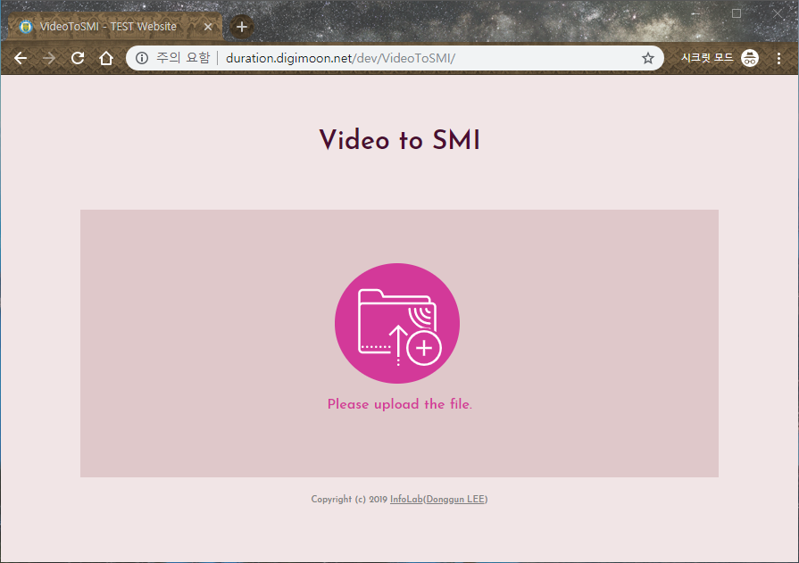
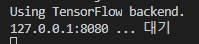
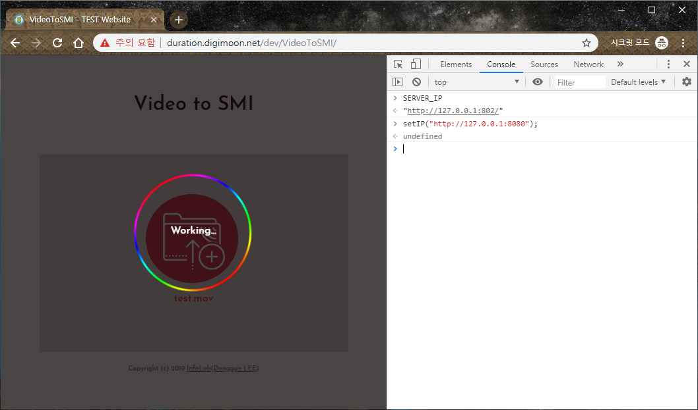
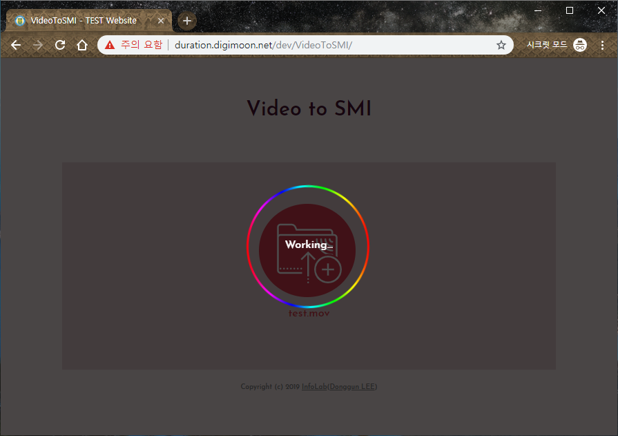
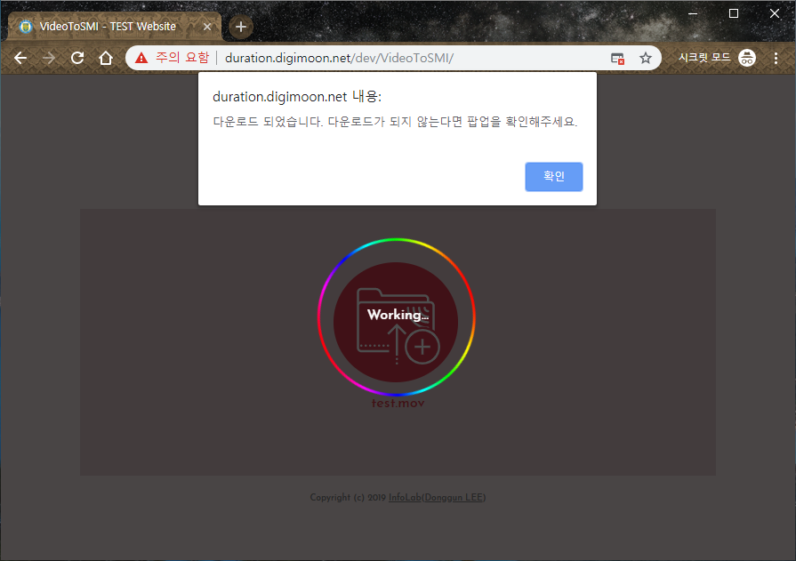

# VideoToSMI-Website
Create a smi file in Web based on the video
- Copyright (c) 2019 [InfoLab](http://infolab.kunsan.ac.kr) ([Donggun LEE](http://duration.digimoon.net))
- Font : [Josefin Sans](https://fonts.google.com/specimen/Josefin+Sans)(Santiago Orozco/Principal design)

## Server
- [VideoToSMI-Server](https://github.com/Sotaneum/VideoToSMI-Server)
 
## DEMO
 - [TEST PAGE](http://duration.digimoon.net/dev/VideoToSMI/)

## Preview
    

# How to use
## STEP1 . VideoToSMI-Server Run

## STEP2 . index.html Run Or Goto [DEMO](http://duration.digimoon.net/dev/VideoToSMI/) page

## STEP3 . Access to developer mode And Write "setIP(your server uri)"

## STEP4 . Click Image And Select File And Waiting.

## STEP5 . Download SMI FILE

